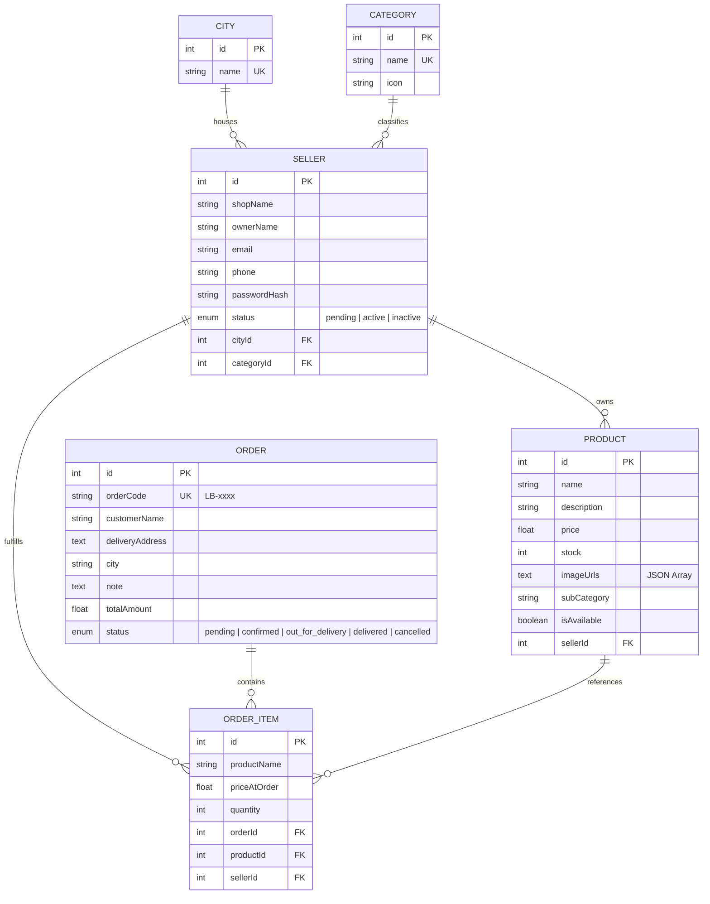

# Aapana Vyapar (Local Bazaar) Backend API 🚀

Welcome to the backend engine for **Aapana Vyapar** (also known as *Local Bazaar*). This is a production-grade, highly-extensible **Node.js** and **Express.js** web server built using **Sequelize ORM** and configured to connect to a **PostgreSQL** database (integrated with **Supabase**). It powers the Aapana Vyapar Flutter mobile client by offering complete role-based commerce services for Public Users, Sellers, and Platform Administrators.

---

## 🌟 Key Features

*   **Relational Database Engine:** Out-of-the-box support for PostgreSQL with Sequelize. Automatically handles database synchronizations (`alter: true`) and schema updates.
*   **Secure Role-Based Authentication:** Complete JWT authorization flows for both **Sellers** and **Platform Administrators** with request-level middleware enforcement.
*   **Automatic Seeders:** Dynamic seeding on database synchronization to bootstrap major Indian cities and marketplace categories.
*   **Robust Image Management:** Seamless local upload handling for product media, shop logos, and banners using **Multer** disk-storage configuration with automated file filters (images only) and size constraints (5MB limit).
*   **Fully-Formed Database Relationships:** Solid referential integrity mapping across Cities, Categories, Sellers, Products, Orders, and Order Items (cascade deletes configured).
*   **Deployment Ready:** Includes native configurations (`render.yaml`) for instant zero-configuration deployment on **Render.com**.

---

## 📂 Backend Architecture

Below is the structured layout of the backend application:

```text
backend/
├── config/
│   └── database.js          # Sequelize connection manager (PostgreSQL SSL config)
├── controllers/
│   ├── adminController.js   # Admin action controllers (Sellers status, Categories, Cities)
│   ├── authController.js    # Authentication handler (Register/Login for Admin & Sellers)
│   ├── publicController.js  # General product browsing, shop filtering, order placement
│   └── sellerController.js  # Seller operations (Profile editing, product CRUD, order viewing)
├── middleware/
│   ├── authMiddleware.js    # JWT authorization and role verification middlewares
│   ├── errorHandler.js      # Global JSON-compliant Express error handler
│   └── uploadMiddleware.js  # Multer engine for handling image uploads
├── models/
│   ├── index.js             # Association registry & Database client exports
│   ├── Category.js          # Product categories (Grocery, Electronics, etc.)
│   ├── City.js              # Marketplace cities (Mumbai, Delhi, Pune, etc.)
│   ├── Seller.js            # Registered shop owners details & account status
│   ├── Product.js           # Items listed by sellers, tracking stock & image links
│   ├── Order.js             # General customer checkout details & delivery state
│   └── OrderItem.js         # Ordered item snapshots linked to Products & Sellers
├── seeders/
│   └── seed.js              # Database seeder script for categories and cities
├── uploads/                 # Static directory for uploaded product/shop assets
├── .env                     # Local environment variables (git-ignored)
├── .gitignore               # Ignored local files, logs, node_modules, and DB files
├── package.json             # Service metadata and NPM package scripts
├── render.yaml              # Blueprint file for Render cloud deployment
└── server.js                # App entrypoint (initializes Express, middleware, database connection)
```

---

## 🗄️ Database Schema & Associations

The backend utilizes six primary relational entities. The relationships are defined as follows:



*   **Cascade Deletes:** Deleting a `Seller` automatically purges all their `Products`. Similarly, deleting an `Order` removes all associated `OrderItems` to ensure database hygiene.

---

## ⚙️ Environment Variables Config

Create a `.env` file in the root of the `backend` folder and populate it with the appropriate values:

```env
# Server Environment Settings
NODE_ENV=development
PORT=10000

# PostgreSQL Connection String (e.g. Supabase, AWS RDS, or local pg)
DATABASE_URL=postgresql://<username>:<password>@<host>:<port>/<dbname>

# Authentication Secret
JWT_SECRET=your_super_secure_jwt_secret_token_key

# Default Platform Administrator Credentials
ADMIN_USERNAME=admin
ADMIN_PASSWORD=admin123
```

---

## 🔌 API Reference

### 1. Public Endpoints (Accessible by Flutter Client / Users)

| HTTP Method | Route | Description | Request Body / Query Params |
| :--- | :--- | :--- | :--- |
| **POST** | `/api/auth/seller/register` | Register a new seller account. Returns status `pending`. | `{ shopName, ownerName, cityId, categoryId, password, email, phone }` |
| **POST** | `/api/auth/seller/login` | Login as a seller. Allowed only if status is `active`. | `{ shopName, password }` |
| **POST** | `/api/auth/admin/login` | Login as platform admin using `.env` values. | `{ username, password }` |
| **GET** | `/api/cities` | Fetch all cities registered in the system. | *None* |
| **GET** | `/api/categories` | Fetch all shopping categories and their material icons. | *None* |
| **GET** | `/api/shops` | Get all active shops. Filterable by city, category, or search term. | `?city=Mumbai&category=Grocery&search=MegaStore` |
| **GET** | `/api/shops/:id` | Fetch full details for a specific shop. | *None* |
| **GET** | `/api/shops/:id/products` | Retrieve all active products for a shop. Filterable by subcategory. | `?subCategory=Organic` |
| **GET** | `/api/products/:id` | Retrieve detailed product information. | *None* |
| **POST** | `/api/orders` | Place a new multi-item checkout order. Automatically reserves stock. | `{ customerName, deliveryAddress, city, note, items: [{ productId, quantity }] }` |
| **GET** | `/api/orders/track/:orderCode` | Retrieve real-time order status using its tracking code. | *None* |

---

### 2. Seller Secured Endpoints (Requires `Bearer <JWT_Token>`)

These routes are protected by JWT and require the logged-in user to have the `seller` role.

| HTTP Method | Route | Description | Multipart-Form / Request Details |
| :--- | :--- | :--- | :--- |
| **GET** | `/api/seller/profile` | Retrieve profile of the logged-in seller. | *None* |
| **PUT** | `/api/seller/profile` | Update profile details (Description, Email, Phone, Logo, etc.). | `{ description, logoUrl, bannerUrl, email, phone }` |
| **GET** | `/api/seller/products` | Retrieve list of all products belonging to this seller. | *None* |
| **POST** | `/api/seller/products` | Upload a new product listing (Up to 5 images). | **Multipart/Form-Data**: `name`, `description`, `price`, `stock`, `subCategory`, `isAvailable`, file `images` (array) |
| **PUT** | `/api/seller/products/:id` | Update product details or add new images. | **Multipart/Form-Data**: Optional product details and/or additional `images` |
| **DELETE** | `/api/seller/products/:id` | Delete product listing from database. | *None* |
| **GET** | `/api/seller/orders` | Retrieve list of incoming customer orders that contain this seller's products. | *None* |
| **PUT** | `/api/seller/orders/:id/status` | Update delivery/fulfillment status of an order. | `{ status: "confirmed" \| "out_for_delivery" \| "delivered" \| "cancelled" }` |

---

### 3. Administrator Secured Endpoints (Requires `Bearer <JWT_Token>`)

Protected routes only accessible with an `admin` role token.

| HTTP Method | Route | Description | Request Body |
| :--- | :--- | :--- | :--- |
| **GET** | `/api/admin/sellers` | Retrieve list of all registered sellers in the system. | *None* |
| **PUT** | `/api/admin/sellers/:id/approve` | Approve a pending seller account (sets status to `active`). | *None* |
| **PUT** | `/api/admin/sellers/:id/reject` | Suspend or reject a seller (sets status to `inactive`). | *None* |
| **POST** | `/api/admin/cities` | Register a new marketplace city. | `{ name }` |
| **PUT** | `/api/admin/cities/:id` | Modify name of an existing city. | `{ name }` |
| **DELETE** | `/api/admin/cities/:id` | Delete a city from database. | *None* |
| **POST** | `/api/admin/categories` | Add a new business shopping category. | `{ name, icon }` |
| **PUT** | `/api/admin/categories/:id` | Update category details (name or icon). | `{ name, icon }` |
| **DELETE** | `/api/admin/categories/:id` | Delete a category from database. | *None* |
| **GET** | `/api/admin/orders` | View list of all orders placed across the platform. | *None* |

---

## 🚀 Local Development Quickstart

Follow these steps to run the backend server locally on your machine:

### 1. Prerequisite Checklist
*   Ensure **Node.js** (v16.x or higher) is installed.
*   Make sure a **PostgreSQL** instance is active (or set up a free cloud DB via **Supabase**).

### 2. Installation
Navigate to the `backend` directory and install required dependencies:
```bash
npm install
```

### 3. Environment Variables Setup
Copy the environment template, rename it to `.env`, and customize it with your database connection parameters and credentials:
```bash
# In Windows Powershell:
Copy-Item .env.example .env -ErrorAction SilentlyContinue
# Or manually create `.env` in the backend folder
```

### 4. Running the Application
*   **Development Mode (Auto-restart with Nodemon):**
    ```bash
    npm run dev
    ```
*   **Production Execution:**
    ```bash
    npm start
    ```

On server start, Sequelize will automatically synchronize your models with the PostgreSQL database and trigger the seeders to pre-populate required categories and cities.

---

## ☁️ Cloud Deployment Instructions

### 1. Database Provisioning (Supabase)
1.  Go to [Supabase](https://supabase.com/) and create a free project.
2.  Once created, navigate to **Project Settings** -> **Database** and copy your **Transaction Connection String** (URI format).
3.  Append the credentials properly into your `DATABASE_URL` in your env variables.

### 2. Application Deployment (Render.com)
The backend repository is pre-configured with a `render.yaml` infrastructure-as-code file.

1.  Connect your GitHub repository containing the backend to [Render.com](https://render.com/).
2.  Deploy using the **Blueprint** option on Render, or create a new **Web Service**:
    *   **Environment:** `Node`
    *   **Build Command:** `npm install`
    *   **Start Command:** `npm start`
3.  Add the required Environment Variables in the Render dashboard:
    *   `DATABASE_URL` (your Supabase PostgreSQL URI)
    *   `JWT_SECRET` (custom secure string)
    *   `ADMIN_USERNAME` (admin username)
    *   `ADMIN_PASSWORD` (admin password)
    *   `NODE_ENV` = `production`
    *   `PORT` = `10000`

---

## 🛡️ License

This project is licensed under the ISC License. Feel free to customize and expand it to meet your business logic needs.
